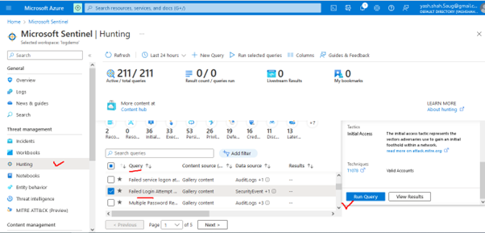
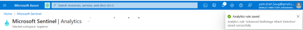

# Monitor-Microsoft-365-Security-with-Microsoft-Sentinel
Use Sentinel. Run Failed Login Attempt Query. Turn on Fusion Machine Learning.

<h2>Description</h2>
Lab consists of a create Password Lockout Policy by using Microsoft Azure AD.Smart lockout helps lock out bad actors that try to guess your users' passwords or use brute-force methods to get in. Smart lockout can recognize sign-ins that come from valid users and treat them differently than ones of attackers and other unknown sources. Attackers get locked out, while your users continue to access their accounts and be productive.	
<br />


<h2>Environments Used </h2>
- <b>Microsoft 365 Defender Portal </b>

<h2>Prerequisites</h2>

-<b> Password Lockout Settings modified by anyone assigned the following roles:
 - Security Administrator
 - Global Administrator
 </b>
- <b> Licenses:  Azure AD Premium P1 or higher licenses </b>

<h2>Program walk-through:</h2>

<h3>Steps: </h3>
1. Steps:
1.	Go to Azure portal --> Azure Sentinel
2.	Select 	Azure Sentinel Workspace
3.	Select Hunting --> select Query ‘Failed login attempt’ --> Run Query
4.	Go to Analytics section --> select active rule --> edit
5.	Enable status of rule --> Configure it
6.	Review & Save

<h3>Screenshots:</h3>

<p align="center">
Select Log Workspace Analytics:  <br/>

<br />
<br />
Select Query:  <br/>

<br />
<br />
Active Rules of Query: <br/>

<br />
<br />
Enable Status: <br/>

<br />
<br />
Result: <br/>

<br />
<br />


</p>

<!--
 ```diff
- text in red
+ text in green
! text in orange
# text in gray
@@ text in purple (and bold)@@
```
--!>
